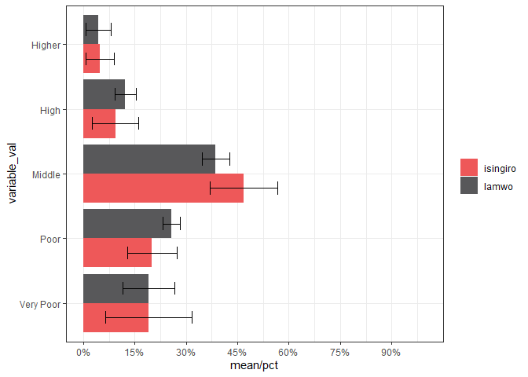
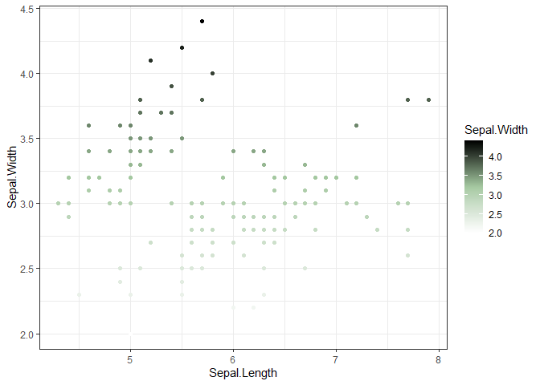

<!-- README.md is generated from README.Rmd. Please edit that file -->

# ggreach

<!-- badges: start -->

<!-- badges: end -->

The goal of ggreach is to facilitate custom REACH-themed plotting and
palette functions that integrate into ggplot figures

## Installation

You can download the latest development version of the package on
[GitHub](https://github.com/) with:

``` r
# install.packages("devtools")
devtools::install_github("zackarno/ggreach")
```

## Example

``` r
library(dplyr)
library(ggplot2)
library(ggreach)
## basic example code
```

### Discrete color scale

Using the iris data set we can do a simple geom point plot and add the
scale\_reach\_color argument. The default setting is discrete colors

``` r
iris %>% 
  ggplot(aes(x=Sepal.Length,y=Sepal.Width, color=Species))+
  geom_point()+
  scale_color_reach()+
  theme_bw()
```


Often when assessment data is crunched (via butteR or HypegrammaR) the
results are a long format data set. These long format datasets are also
very easily piped into ggplot. The **scale\_fill\_reach** function will
fill barplot with REACH-palette colors

``` r
assessment_results %>% 
  filter(variable=="i.income_cat") %>% 
  ggplot(aes(x=variable_val,y=`mean/pct`, fill=subset_1_val))+
  geom_bar(stat="identity",position=position_dodge(width=0.9))+
  coord_flip()+
  scale_fill_reach()+
  theme_bw()+
  theme(
    legend.title = element_blank()
  )
```



### Continuous color scale

To get a continuous color scale you need to specify discrete as F and
specify a REACH palette you want to use.

``` r
iris %>% 
  ggplot(aes(x=Sepal.Length,y=Sepal.Width, color=Sepal.Width))+
  geom_point()+
  scale_color_reach(palette = "reds",discrete = F)+
  theme_bw()
```


There are now multiple singleband palettes

``` r
iris %>% 
  ggplot(aes(x=Sepal.Length,y=Sepal.Width, color=Sepal.Width))+
  geom_point()+
  scale_color_reach(palette = "lightgreens",discrete = F)+
  theme_bw()
```



Currently there are about 12 singleband color palettes based on the
REACH Graphic Charter and just 2 categorical palettes available
(\`classic’, ‘classic\_extended’). However, we will be integrating more
categorical and dual & tri-color ramps.
