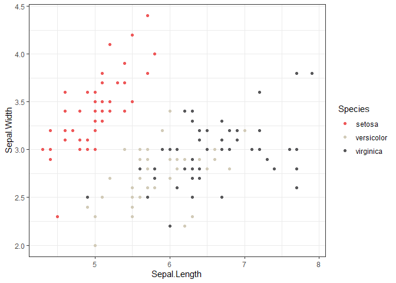
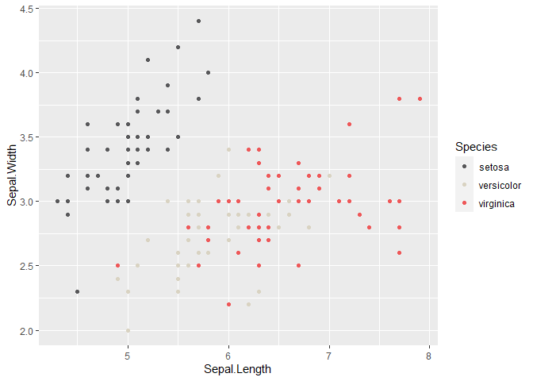

<!-- README.md is generated from README.Rmd. Please edit that file -->

# ggreach

<!-- badges: start -->

<!-- badges: end -->

The goal of ggreach is to is to provide custom REACH-themed plotting and
palette functions that integrate into ggplot figures

## Installation

You can download the latest development version of the package on
[GitHub](https://github.com/) with:

``` r
# install.packages("devtools")
devtools::install_github("zackarno/ggreach")
```

## Example

``` r
library(dplyr)
library(ggplot2)
library(ggreach)
## basic example code
```

### Discrete color scale

Using the iris data set we can do a simple geom point plot and add the
scale\_reach\_color argument. The default setting is discrete colors

``` r
iris %>% 
  ggplot(aes(x=Sepal.Length,y=Sepal.Width, color=Species))+
  geom_point()+
  scale_color_reach()+
  theme_bw()
```



### Continuous color scale

To get a continuous color scale you need to specify discrete as F and
specify a REACH palette you want to use

``` r
iris %>% 
  ggplot(aes(x=Sepal.Length,y=Sepal.Width, color=Sepal.Width))+
  geom_point()+
  scale_color_reach(palette = "reds",discrete = F)+
  theme_bw()
```


### Continuous color scale

``` r
iris %>% 
  ggplot(aes(x=Sepal.Length,y=Sepal.Width, color=Species))+
  geom_point()+
  scale_color_reach(reverse = T)
```


